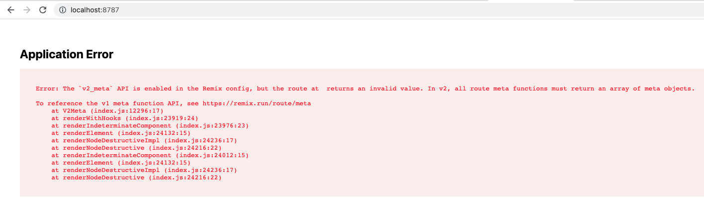

# cf-wrangler-crash-reproduction

This repository is meant to reproduce Wrangler
[pointing to incorrect source code in stack traces](https://github.com/cloudflare/workers-sdk/issues/3383)
in the most minimal way possible.

## How to Use This Repo

In order to reproduce the Wrangler pointing to incorrect source code in stack traces:

1. Run `yarn install` in your terminal
2. Run `yarn dev` in your terminal
3. Visit the link that Wrangler outputs in your browser (e.g. `[mf:inf] Ready on http://127.0.0.1:8787/`)

